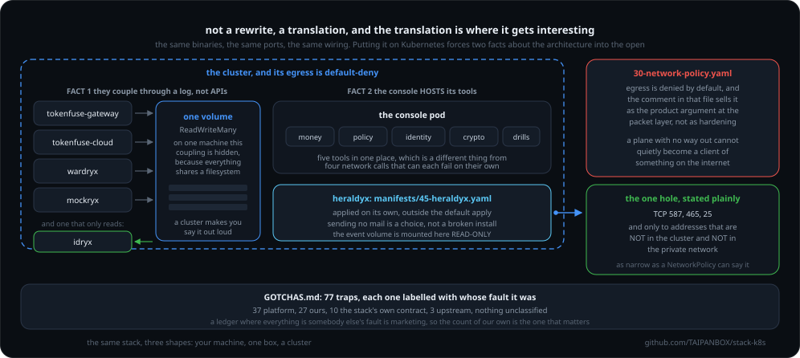

# The agent stack on Kubernetes

`stack-up`'s `up.sh` runs the whole open stack on one machine in one command.
This is the same stack as a Kubernetes workload: the same binaries, the same
ports, the same wiring, expressed as manifests instead of background processes.

Nothing here is a rewrite. It is a translation, and the translation is where
the interesting part lives: putting the stack on Kubernetes forces two facts
about its architecture into the open, and both are load-bearing.

<div align="center">



</div>

## Fact 1: the planes couple through an event log, not through APIs

On one machine that coupling is invisible, because everything shares a
filesystem:

- `tokenfuse-gateway` appends every metered call to `events/tokenfuse.ndjson`
- `wardryx` appends every policy decision to `events/wardryx.ndjson`
- `idryx` is started with `--load tokenfuse:<events file>` and builds its
  identity graph by READING that file
- the Genaryx console's bus tails the same directory

So the event directory is a shared, writable dependency of four components. On
Kubernetes that is not a detail, it is the deployment's shape: pods on
different nodes do not share a filesystem, and the default k3s storage class
(`local-path`) is `ReadWriteOnce`, one node only.

Three honest ways out, in the order a real operator would consider them:

1. **One node.** Pin the four event-coupled pods to a single node with a
   `local-path` volume. Simple, and it works, but the cluster is then a
   scheduler, not a distribution.
2. **A ReadWriteMany volume.** Run an in-cluster NFS provisioner (or Longhorn)
   and give the event directory an RWX claim. The pods spread across nodes and
   the coupling stays exactly as the code expects it. This is what the
   manifests here do, because it is the only option that is genuinely
   multi-node without touching the stack's own code.
3. **Replace the file with a stream.** The correct long-term answer: the
   event log becomes a real append-only service (or a broker) and the
   filesystem stops being an interface. That is a change to the stack, not to
   its deployment, so it is out of scope here and named as future work rather
   than pretended away.

## Fact 2: the console is not a client of four services, it is a host of five tools

The Genaryx console reaches the money, policy and identity planes over HTTP,
so those are ordinary `Service` objects. But it reaches four more tools by
EXECUTING them:

| Tool | How the console uses it |
|---|---|
| `qryx` | shells out to scan a path for crypto (`GENARYX_SCAN_TARGET`) |
| `verdryx` | shells out to read and run quality evals against `verdryx.db` |
| `engram-mcp` | speaks MCP over **stdio** to a child process |
| `mockryx` | shells out to fire the hostile drills at the gateway |

A sidecar container cannot be another container's stdin. So these four are not
pods: they are binaries that must exist **inside the console image**. That is
why `images/console.Dockerfile` is a four-language build (Rust console, Go
qryx and mockryx, Python verdryx and engram) rather than four Deployments.

Stated plainly because it is the opposite of the obvious guess, and getting it
wrong produces a cluster where half the console's tabs are permanently empty.

## What runs as what

| Kubernetes object | Component | Port |
|---|---|---|
| Deployment + Service | `tokenfuse-cloud` | 8080 |
| Deployment + Service | `tokenfuse-gateway` | 4100 |
| Deployment + Service | `wardryx` | 8090 |
| Deployment + Service | `idryx` | 8081 |
| Deployment + Service | `genaryx-console` (with qryx, verdryx, engram, mockryx inside) | 7420 |
| StatefulSet + Service | the policy store: Postgres behind `wardryx`, holding its approvals and its runtime policy documents | 5432 |
| PersistentVolumeClaim (RWX) | the shared event directory | |
| PersistentVolumeClaim | `verdryx.db`, `engram.engram` stores | |
| CronJob | three of `routines.sh`'s five governance routines: crypto trend, quality drift, identity sweep (`qryx-trend`, `verdryx-drift`, `idryx-detect`), plus the record seal (`trailryx-seal`, at 5:27, last because it seals what the others did). FinOps export (`focus-export`) cannot run as a CronJob here and does not: its data lives in a per-pod `emptyDir` (GOTCHAS 81), so since 2026-08-28 it runs as a SIDECAR in the `tokenfuse-gateway` pod, hourly, printing rather than storing. The alternative was a PersistentVolumeClaim for the trace directory, which is a billed disk and so a spending decision rather than a fix; `drills` (`mockryx-drill`) is separate: opt-in, suspended below | |
| CronJob | `agent-conform`, the on-box chain verifier, every 15 minutes: it verifies the `prev_hash` chain of every stream on the shared bus and writes a `chain_broken` event to `agent-conform.ndjson` on the bus when one is broken. In the default apply; keeps its memory beside its output on `stack-events`, so it adds no disk. See "The on-box chain verifier" below | |
| NetworkPolicy | default-deny, then exactly the paths above | |
| Deployment + PVC + NetworkPolicy | `heraldyx`, the notifier. **Not in the default apply**, see "Being told, rather than watching" below. No Service and no port: it reads the event log and sends mail, so nothing calls it | |
| Deployment + PVC + Service + NetworkPolicy x4 | `47-scopyx.yaml`, the web-egress enforcement point. **Not in the default apply**: it opens 80 and 443 to the whole public internet on behalf of agents, which is the widest grant in the namespace and the one decision an operator most needs to have made themselves. Refuses to start without a credential, deliberately | |
| Deployment | `48-scopyx-browser.yaml`, the same plane with a real browser, for pages that assemble themselves. **Replaces 47's Deployment rather than running beside it**, so a cluster cannot round-robin an agent's fetches between a browser and a fetcher that runs no JavaScript. Costs 267 MB of pull against 3.5 MB. Read its header: PodSecurity `restricted` decides the sandbox question for you | |
| Deployment + PVC + Service | `51-typryx.yaml`, the typed-answer plane: a typed question answered with a probability, scored later against what actually happened. **Not in the default apply**: a whole plane somebody may simply not want. Backend is `stub` (free, no outbound call) unless a launcher is given `--typed-mode` (see "Typed answers: choose where your data goes"). Refuses to start without a credential, the same as scopyx. Its journal is on the shared `stack-events` bus | |
| Deployment + Service + NetworkPolicy x4 | `52-tokenfuse-mcp-broker.yaml`, tokenfuse's own MCP credential broker fronting typryx. **Not in the default apply, applied by the same `--with-typed` flag as 51-typryx.yaml, right after it**. Free, reaches nowhere but typryx itself. Refuses to start without its own credential | |
| Deployment + Service + NetworkPolicy x4 | `56-typryx-wardryx-proxy.yaml`, typryx's `wardryx-proxy`: between the MCP broker and wardryx, it adds the risk class of a pending tool call to the decision request, so a `hold_if_signal` policy can hold the call for a person. **Not in the default apply, rendered only by `--typed-risk-signal`** (off by default, refused when the typed mode is off). No claim, no journal, no ledger: it keeps no state. See "A typed risk signal" below | 4330 |
| Deployment + Service + PVC + NetworkPolicy x3 | `54-delegation.yaml`, vouchryx, the delegation-token service. **Not in the default apply, applied by `delegation/up.sh`**, which also refuses before applying anything unless a trusted upstream issuer, audience and JWKS file are given. Reachable only from the gateway and the console. See "The delegation plane" below | |
| Patch (Deployment) | `55-copilot-cloud.yaml`: moves the console's copilot, Felyx, to a larger model. By default Felyx already reaches Anthropic through this stack's own gateway (by its Service name, under `agent://<trust domain>/genaryx/felyx`, metered and policy-checked like any agent) and needs only the `stack-copilot` Secret holding your key; without it Felyx says it is not configured. **Not in the default apply, opt-in, and METERED**: every conversation is billed by the model provider to the key's owner, on a bill separate from the cluster. See its own header before applying | |
| Namespace labels + NetworkPolicy x2 | `60-harden-neighbours.yaml`: Pod Security `restricted` plus default-deny ingress and egress for the cluster's `default` namespace, i.e. hardening for a namespace this stack does not own (`security-tests.sh` check 12 reports on the gap this closes). **Not in the default apply**: it changes a namespace that belongs to whoever runs the cluster, and it WILL stop anything already running in `default`. Read its header before applying | |

## Keys stay yours

Nothing here bakes a credential into an image, and nothing here ships one.
`install.sh` GENERATES the admin bearers for the money and policy planes, the
policy store's database password and its approval secret, straight into Secrets
on your own cluster. This repo never sees them.

One of them is easy to miss because nothing in the stack uses it: the gateway's
`POST /v1/fuse/declassify` (the release valve for its agent firewall: a person
reviews a run and the taint label comes off it) is not behind the gateway's
admin key. It has a key of its own, `x-fuse-declassify-key`, and the gateway
treats it as optional, so with none set anything that reaches port 4100 can
clear a run. The installers therefore mint `declassify_key` into the
`stack-keys` Secret (the gateway reads it as `TOKENFUSE_DECLASSIFY_KEY`) and
pass it in on stdin, never as a command-line argument. Clearing a run needs it:

```bash
kubectl -n agent-stack get secret stack-keys -o jsonpath='{.data.declassify_key}' | base64 -d
```

A cluster installed before this key existed gets it the next time an installer
runs against it. Applying the manifests alone leaves its gateway pod waiting
for a key that is not there, which is deliberate: an optional key would start
the gateway with the endpoint open.

That is a correction, not a design note. The manifests used to hand out
`TOKENFUSE_CLOUD_ALLOW_DEVKEY=1`, which makes the literal string `devkey` an
admin bearer, and to leave `WARDRYX_KEYS` unset, which makes the policy plane
accept ANY bearer. On one machine that is a dev convenience. In a cluster it is
a published credential: on 2026-07-25 a pod that labelled itself
`plane: console` used it to delete a freeze, and the frozen agent resumed while
the console still displayed FROZEN (GOTCHAS 20).

The operator's own login is separate and stays theirs: one account per box, set
with `genaryx-web set-password` reading the password from stdin, stored as an
Argon2id hash on the console's volume. There is no path by which we could
issue, see or reset it.

## Layout

```
deploy.sh       THE entry point. Asks what it needs, then: install.sh, images,
                manifests, verify.sh, security-tests.sh, and your way in.
install.sh      the cluster itself: k3s, Calico, Longhorn, the storage classes,
                the cloud controller. Hetzner-specific by design.
build.sh        build images from source at :dev and import them into every
                node over ssh. Nothing needs building any more, so this is the
                escape hatch: a change that is not released yet, or a cluster
                with no way out to ghcr.io. BUILD_PLANES=1 adds the Go planes
verify.sh       prove a cluster is running this stack, not merely green
security-tests.sh  attack it: every fix below re-run as a standing check, from
                a forged pod label to the bytes in etcd. Two dozen of them, and
                the exact count varies with what a given cloud exposes
tunnel/         the operator's way in: WireGuard, TLS, and the console behind
                both. Nothing here is published; see tunnel/README.md
hub/            a second site's way IN: up.sh, add-site.sh, down.sh for
                manifests/53-hub-entry.yaml, the hub's one metered public
                entry. See "A second site" below
delegation/     the delegation plane's opt-in: up.sh, down.sh for
                manifests/54-delegation.yaml (vouchryx). See "The delegation
                plane" below
manifests/      plain YAML + a kustomization, applied with kubectl -k (no Helm).
                Three files are opt-in and outside the default apply, each
                applied by hand: 45-heraldyx.yaml (notifications), 55-copilot-
                cloud.yaml (a metered cloud copilot) and 60-harden-
                neighbours.yaml (hardening for the cluster's other
                namespaces). See "What runs as what" above
images/         one Dockerfile per language family, plus the console's mixed build
GOTCHAS.md      every trap this cost us, each with the fix that is already applied
PORTABILITY.md  the measured Hetzner baseline, and what to compare AWS/GCP on
cloud/          the same cluster on AWS and on GCP: Terraform, the installer
                differences, the teardown, and COSTS.md for what each one burns
evidence/       command output from the live cluster, not claims about it
```

## Running it

One command. It asks what it needs BEFORE the long part, so a missing DNS
record costs ten seconds rather than a quarter of an hour of building.

**A node builds nothing.** Every image these manifests name is published at
`ghcr.io/taipanbox/<name>`, pinned to an immutable version tag, pulled by the
kubelet, and carrying both `linux/amd64` and `linux/arm64`. That became true of
all of them on 2026-09-01; until then `tokenfuse` and the console were still
assembled on a node, and building the console was most of a deploy.

That means **every node needs to reach `ghcr.io`**. These nodes already reach
the internet for k3s, Longhorn and Calico, so it is one more host rather than a
new requirement. A cluster that genuinely cannot: `BUILD_PLANES=1 ./build.sh`
builds locally at `:dev`, and the manifests then need their image lines
pointed at what you built.

```bash
git clone https://github.com/TAIPANBOX/stack-k8s && cd stack-k8s
./deploy.sh --servers ip1,ip2,ip3 --agents ip4,ip5 --hcloud-token <token> \
  --trust-domain acme.example
```

`--trust-domain` is the domain your agents carry in their ids
(`agent://acme.example/...`). The manifests ship a placeholder there on purpose
and `verify.sh` fails on it, so leave the flag out and the deploy ends red.

What it asks, in order:

| | |
|---|---|
| the operator tunnel? | `Y/n`. No means you will reach the console with `ssh -L`, which is a real way to run this |
| your console domain | must have an A record at `10.9.0.1`. Checked against DNS while you are still watching |
| your gateway host | must have an A record at a public address of one of your nodes. Also checked |
| the console account | username, and a password typed blind and twice. Blank generates one |

Then it installs, and ends by issuing your first WireGuard device: a `.conf`
saved beside the script at mode 0600, a QR for a phone, and the address to open.

The whole conversation can be skipped for automation:

```bash
./deploy.sh --servers ip1,ip2,ip3 --hcloud-token <token> \
  --console-domain box.you.com --endpoint-host gw.you.com
```

or `--no-tunnel` to leave the way in for later. There is deliberately no
`--console-password`: an argument is visible in `ps` to every user on the
machine for as long as the deploy runs.

Piped from curl it still works, and with no terminal to ask on it says so and
names the flags rather than hanging or guessing:

```bash
curl -fsSL https://raw.githubusercontent.com/TAIPANBOX/stack-k8s/main/deploy.sh | bash -s -- \
  --servers ip1,ip2,ip3 --hcloud-token <token> --no-tunnel
```

### The parts, if you want them separately

```bash
./install.sh --servers ip1,ip2,ip3 --agents ip4,ip5 --token <hcloud-token>
./build.sh root@ip1 root@ip2 root@ip3 root@ip4 root@ip5
kubectl apply -k manifests/
KUBECONFIG=./kubeconfig.yaml ./tunnel/up.sh
```

Every one of them is idempotent, and that is now true rather than merely
claimed: the first time anyone ran this twice on the same machine it broke six
times, each a step correct once and impossible the second time. GOTCHAS 56-62.

Nothing here needs a credential. Every repository this pulls is public and
Apache-2.0, the Genaryx console included since 2026-07-27, so the console comes
up by default rather than on production of a token. `--console-token` survives
for the one case it is still good for: building the console from a private fork
of your own.

Then reach the console over your own tunnel (`20-console.yaml` explains why
there is no public entry point by default), and check the deployment with
`./verify.sh --freeze` and `./security-tests.sh`.

### The run-budget ceiling

A run's budget used to come from the header the agent sends, and the next call of
an open run could widen it, so with no client keys, no identity map and no unit
caps the per-run ceiling was whatever the agent said. Since tokenfuse v1.5.0 the
gateway has a ceiling the operator sets, and `10-planes.yaml` sets it:
`TOKENFUSE_MAX_RUN_BUDGET_USD` is `5.00` on the gateway container.

- **What 5.00 means.** It is the gateway's own built-in run budget, so an ordinary
  run is unchanged and only a budget a caller declares above 5.00 is lowered to
  it (the answer to a lowered call carries `x-fuse-budget-clamped`). A caller can
  always ask for less.
- **What it does not do.** It does not lower a budget the Cloud sets, and it
  bounds each run, not an agent's total spend: an agent that opens a new run id
  gets a new ceiling's worth.
- **Changing it.** `--run-budget-ceiling USD` on `deploy.sh`, `deploy-gcp.sh` and
  `deploy-aws.sh` (or `RUN_BUDGET_CEILING` in the environment): a positive figure
  with up to six decimals, no sign, no exponent, checked before anything is
  installed. It is applied after the manifests, because `apply -k` puts the
  declared 5.00 back over anything set before it or by hand, and it rolls the
  gateway to the new figure by itself. Give the flag on every run: a re-run
  without it returns the gateway to 5.00.

```bash
./deploy.sh --servers ... --hcloud-token ... --trust-domain acme.example \
  --run-budget-ceiling 2.50
```

### Being told, rather than watching

`deploy.sh` asks for an address for alerts alongside the tunnel and the console
account. Answer it and the box mails you when one of your own agents crosses a
line: a budget gone, a policy denial, a run killed, an agent behaving unlike
itself. The mail comes from the box, and it carries a link into your console,
never a button that acts.

Leave it blank and nothing is installed for it. This is the one workload in the
stack allowed to open a connection to something outside the cluster, so it is
opt-in the same way the load balancer is, and for the same kind of reason:

```bash
kubectl apply -f manifests/45-heraldyx.yaml
```

Read that file's header before you do. It carries the only egress rule in the
namespace that reaches past DNS, it says exactly how narrow that rule is, and
it says what it leaves open.

### The typed-answer plane

`typryx` is off by default for a smaller reason than heraldyx or scopyx: with
`--with-typed` alone it reaches nowhere outbound (its backend is `stub`, free and
deterministic) and enforces nothing, it is simply a whole plane somebody may not
want. `./deploy.sh --with-typed` applies it after the kustomization on the stub;
the next section is how to give it a real backend. By hand the stub is

```bash
kubectl apply -f manifests/51-typryx.yaml
kubectl -n agent-stack create secret generic typryx-keys \
  --from-literal=TYPRYX_KEYS='pick-a-long-secret=agent://acme.example/support-bot'
```

Without that Secret the pod refuses to start, the same stance scopyx takes on
its own key. Its journal is on the shared event bus (`stack-events`), the same
place every other plane's history lives; the record plane's own mapper does
not seal typryx's event types today regardless (`manifests/51-typryx.yaml`
says why), so that is a place to read them, not a claim that they are sealed.

tokenfuse's MCP broker fronts typryx by configuration since 2026-09-26:

```bash
kubectl apply -f manifests/52-tokenfuse-mcp-broker.yaml
kubectl -n agent-stack create secret generic tokenfuse-mcp-broker-keys \
  --from-literal=TOKENFUSE_MCP_KEYS='pick-a-different-long-secret:broker-caller' \
  --from-literal=TOKENFUSE_MCP_SECRETS="typryx_key=$(kubectl -n agent-stack get secret typryx-keys -o jsonpath='{.data.TYPRYX_KEYS}' | base64 -d | cut -d, -f1 | cut -d= -f1)"
```

The key id after the colon is a bare name, not an `agent://` id: tokenfuse
splits each `secret:key_id` entry on its LAST colon, so a URI there turns
`agent` into the end of the secret and the caller's real secret is refused
401 (`scripts/client-key-ids-are-bare.sh`).

`manifests/52-tokenfuse-mcp-broker.yaml` has the full story: why two Secrets
rather than one, what its NetworkPolicies admit, and what was measured
through it on kind (it needs typryx v0.2.0 or later; `51-typryx.yaml` pins
v0.4.0; GOTCHAS 106). Reaching typryx directly,
without the broker, is unchanged, over your own tunnel or

```bash
kubectl -n agent-stack port-forward svc/typryx 4320:4320
```

### Typed answers: choose where your data goes

`@decided 2026-09-30`: a customer picks where the data of a typed answer goes,
from three modes, and the launchers ask. Nothing is chosen for you: the default
sends nothing anywhere, because Jev is a paid service and either real mode is a
data-egress decision. The flags are the same on `deploy.sh`,
`cloud/gcp/deploy-gcp.sh` and `cloud/aws/deploy-aws.sh`, and `typed/mode.sh`
holds the one copy of their checks.

| Mode | Flags | What leaves the cluster | Measured, 2026-09-30 |
|---|---|---|---|
| off (default) | none, or `--typed-mode off` | Nothing. typryx is not deployed. | no typryx, a constant default answer: 25.1% accuracy |
| stub | `--with-typed` alone | Nothing. Free and deterministic, it answers nobody's real question. | none, it is a stand-in |
| jev | `--typed-mode jev --typed-jev-key-file PATH` | The named fields of each question go to TypeSafe's hosted API, a paid service billed to your key. Only the fields a template names are sent. | 87.1% accuracy, ECE 0.042, p50 229 ms |
| own-model | `--typed-mode own-model --typed-model-url URL --typed-model-name NAME` (optional: `--typed-model-key-file PATH`, `--typed-model-cidr CIDR`) | Nothing, if the URL is a model server you run (Ollama, vLLM, any OpenAI-compatible one) inside your cluster or network. If the URL is a hosted service, what you send it. | qwen2.5:7b on an 8-vCPU CPU VM: 70.0% accuracy, ECE 0.273, p50 2130 ms |

`@measured` on the 434-question frozen test in typryx-evalset, run 2026-09-30,
one run per row. Read the numbers as one model on one test set: the own-model row
is a 7B model on CPU before any fine-tuning or calibration on your own data, so
it is a floor for that mode and not its ceiling, and nothing here measures what a
tuned model would score.

```bash
# Jev: the key is a file on the machine running the launcher
./deploy.sh --servers 1.2.3.4,1.2.3.5,1.2.3.6 --typed-mode jev \
  --typed-jev-key-file ~/keys/jev.key

# Your own model, on your own hardware
./deploy.sh --servers 1.2.3.4,1.2.3.5,1.2.3.6 --typed-mode own-model \
  --typed-model-url http://10.0.0.20:11434/v1 --typed-model-name qwen2.5:7b
```

How each mode behaves, because the defaults are deliberate:

- **The key is a file, never a value.** `--typed-jev-key-file` (and the optional
  `--typed-model-key-file`) name a file. The launcher checks it exists and is not
  empty before it installs anything, and refuses by name if not. It becomes a
  Kubernetes Secret (`typryx-jev-key`, `typryx-model-key`) built on stdin,
  mounted into the pod as a file, and `TYPRYX_JEV_KEY_FILE` (or
  `TYPRYX_OPENAI_KEY_FILE`) points at it. It is never an environment value, never
  in a ConfigMap, never on a command line, never printed, and never in a rendered
  manifest. There is deliberately no flag that takes the key itself.
- **The URL ends in `/v1`.** `--typed-model-url` must, and must not carry
  credentials. `--typed-model-name` is required with it.
- **typryx gets one way out, and only in these two modes.** The stack is
  default-deny, so each real mode adds a NetworkPolicy, `typryx-egress-model`:
  Jev gets port 443 to the public internet with the private ranges excluded; an
  own model gets exactly the address and port in its URL (an IP literal becomes a
  `/32`, `name.namespace.svc` becomes that namespace). A model reached by a host
  name on your own LAN needs `--typed-model-cidr` to say which network, because a
  NetworkPolicy cannot match a name.
- **Flags of another mode are refused, not ignored**, so a Jev key file next to
  `own-model` is an error rather than a key quietly not used. `--with-typed`
  together with `--typed-mode off` is refused as a contradiction.
- **Switching modes is an ordinary re-run**, because each mode is rendered whole
  and applied, not patched. `off` does not remove a typryx an earlier run
  installed, and switching back to the stub leaves `typryx-egress-model` and the
  key Secrets behind (an `apply` does not prune; this repository does not delete
  keys on its own initiative). Remove them yourself if you want them gone:
  `kubectl -n agent-stack delete networkpolicy typryx-egress-model`.
- **The door key is unchanged.** `typryx-keys` is still made by hand, in every
  mode, as above.

**Training on your own data.** `@decided 2026-09-30`: we do not fine-tune or
ship models for customers. A customer can fine-tune and calibrate their own model
on their own data, and typryx gives them what they need to do it. Add
`--typed-training` to any launcher, next to `--with-typed` or a `--typed-mode`,
and typryx (v0.3.0 or later; `51-typryx.yaml` pins v0.4.0) keeps a local training
log: one line per answered question holding the state the template let through
and the identity of the answer, never the backend's answer or its probabilities.
You post what actually happened to `/v1/outcome`, and `typryx export --training`
pairs each logged question with that human truth. The truths you post are your
own data. Answers a hosted backend returns are not suitable as training labels
for another model (TypeSafe's agreement forbids it for Jev), which is why the log
holds none.

```bash
./deploy.sh --servers 1.2.3.4,1.2.3.5,1.2.3.6 --typed-mode own-model \
  --typed-model-url http://10.0.0.20:11434/v1 --typed-model-name qwen2.5:7b \
  --typed-training

# later, on your own machine; stdout is the training file, stderr the counts
kubectl -n agent-stack exec deploy/typryx -- /usr/local/bin/typryx export --training \
  --training-dir /var/lib/typryx/training --ledger /var/lib/typryx/ledger > train.jsonl
```

- **Off by default, and byte for byte.** Without the flag no mode renders the
  variable, and every render is exactly what it was before the flag existed. With
  it, each mode gains one environment variable, `TYPRYX_TRAINING_DIR`, and a
  comment; no volume, claim or policy comes with it. `--typed-training` with no
  typryx to write it (no `--with-typed`, or `--typed-mode off`) is refused.
- **No new disk.** A PersistentVolumeClaim provisions a real disk that is billed
  from creation on a cloud cluster, so a flag does not add one. The log is a
  directory (`/var/lib/typryx/training`) on `typryx-state`, the claim typryx
  already has for its ledger. That is also where it is useful: the export pairs
  the log with truths on the ledger, so a log that died with the pod beside a
  ledger that survives it would have nothing to pair with. It is not on
  `stack-events`, the shared bus other planes read, because it holds question
  text.
- **How long it lives, and how big it gets.** As long as the `typryx-state`
  claim: deleting the claim or the namespace ends it, and a pod restart does not.
  It shares that claim's 1Gi with the ledger, and typryx never rotates or deletes
  the file, so watch its size yourself. The file is plain text at rest on the
  claim's disk (typryx creates it `0600`); treat it as you treat the ledger. A
  bigger or separate volume is a claim of your own, which is a spending decision
  that is yours to make and apply, not something a launcher flag does for you.
- **What typryx does not do.** It does not train, host or ship a model. The
  fine-tune happens with your own tooling on your own hardware, and you then
  serve the tuned model behind `--typed-mode own-model`.

**Not proven.** This was checked without a cluster: every mode, with and
without `--typed-training`, renders to a schema-valid manifest
(`kubeconform --strict`) and the gate in `scripts/typed-mode-is-honest.sh` holds
the rules above. A pod starting with the key Secret mounted, the egress rule
reaching a real model, typryx writing `training.ndjson` on the `typryx-state`
claim (it is meant to be writable there, like the ledger beside it, by the same
`fsGroup`), and the `kubectl exec` export above, have not been run through these
launchers.

### A typed risk signal

Use this when you want a person to approve a tool call because a classifier says
it is probably destructive, an external send, or a money movement. It needs
typryx deployed (`--with-typed`, or a `--typed-mode`), a wardryx of v1.2.0 or
later, and a policy rule you write. All of it is off by default.

```bash
./deploy.sh ... --with-typed --typed-risk-signal           # the free stub backend
./deploy.sh ... --typed-mode jev --typed-jev-key-file ~/jev.key --typed-risk-signal
```

- **What it adds.** `56-typryx-wardryx-proxy.yaml`, typryx's `wardryx-proxy`, as
  its own Deployment. It forwards every request to wardryx unchanged. For a
  `POST /v1/decide` that carries a pending tool call (a name and whole
  arguments), it asks typryx which of `read_only`, `reversible_change`,
  `destructive`, `external_send` and `financial` the call belongs to, and adds the
  answer to the request as a `signals` entry. No answer in time, truncated
  arguments, or anything unusual: the request is forwarded untouched, never
  refused. It answers from the same backend you chose for typryx (same key, same
  egress rule, no wider) and keeps no state: no claim, no journal, no ledger and
  no training log, so the tool-call arguments it asks about are not written down.
- **Where it sits.** Only tokenfuse's MCP broker asks wardryx through it. The LLM
  gateway keeps asking wardryx directly, so a slow typed answer never sits on the
  model path. The broker asked wardryx nothing before; with the flag it asks about
  every tool call, fails closed, and uses the same viewer key as the gateway.
- **What it costs.** Each tool call that carries a name and whole arguments is one
  typryx ask. In the `jev` mode that is a paid call, and the tool name, arguments
  and target leave the cluster; the proxy has its own hourly cap
  (`TYPRYX_MAX_CALLS_PER_HOUR`, default 1000). The `stub` backend's probabilities
  mean nothing: do not write a rule against them.
- **What holds nothing.** No policy is seeded. Until you write a `hold_if_signal`
  rule the signal is added and ignored. A rule can turn an allow into a hold for a
  person and nothing else; wardryx refuses a rule that would deny on a signal.

An example policy, written once, through the policy API (read the key from the
cluster, reach wardryx with a port-forward, since the namespace is default-deny):

```bash
ADMIN_KEY="$(kubectl -n agent-stack get secret stack-keys -o jsonpath='{.data.wardryx_admin}' | base64 -d)"
kubectl -n agent-stack port-forward svc/wardryx 8090:8090 &
curl -X PUT localhost:8090/v1/policies/support-risk \
  -H "Authorization: Bearer $ADMIN_KEY" -H "Content-Type: application/json" \
  -d '{"target": "agent://acme.example/support/*",
       "hold_if_signal": {"name": "action.risk_class",
                          "values": ["destructive", "external_send", "financial"],
                          "min_probability": 0.8}}'
```

A call the rule holds waits for a person to approve it in the console; the
approval is bound to the exact call they read (wardryx v1.2.0), so the same
arguments re-spaced are another call.

**Not proven.** Checked without a cluster: every mode renders with the flag to
schema-valid manifests (`kubeconform --strict`), the gate in
`scripts/typed-mode-is-honest.sh` holds the rules above, and the proxy was run as
a container against a stand-in wardryx. A pod behind these NetworkPolicies, wardryx
holding a real call on a real signal, the broker's decision reaching the proxy in
a cluster, and the latency the proxy adds with a hosted backend, have not been run
through these launchers. The proxy's ask deadline (3000 ms) and the broker's wait
(7000 ms, longer than the most the proxy will accept, 5000 ms) are chosen from
the Jev median (about 230 ms) and an own model's measured median on CPU (2,130 ms
for qwen2.5:7b on 8 vCPU), not measured on a cluster. The proxy binds the pod address with
`TYPRYX_ALLOW_OPEN_BIND=1`, because the broker cannot send an `X-Typryx-Key`; its
door is the one NetworkPolicy that admits the broker alone.

### The on-box chain verifier

Every stream on the shared bus is a hash chain, and nothing on a box checked one
until agent-stack-go v1.1.0's `agent-conform watch-dir`. A CronJob in the default
apply (`agent-conform`, in `40-routines-and-secrets.yaml`) runs it every 15
minutes over the bus. A break becomes a `chain_broken` event (high) in
`agent-conform.ndjson` on the bus, where heraldyx and the console already read; a
chain with no `prev_hash` at all is reported once as `chain_unchained` (low),
since the field is optional. heraldyx v0.3.0 has no sentence for `chain_broken`
and renders it with its generic wording ("raised an event this build does not
have a description for"), which is neutral and true.

- **A new break fails the Job**, once, on purpose: a second signal beside the
  event, and `verify.sh` counts the failed pod as not Running until it ages out
  (three are kept). The next run exits 0, because the finding is remembered.
- **Where it remembers.** In `agent-conform.state.json` beside its output on
  `stack-events`. An `emptyDir` would forget between runs (each run is a new pod)
  and announce a persistent break every 15 minutes, and a claim of its own is a
  billed disk, which is your decision, so it adds none. It holds the bus
  read-write, runs as uid 10002 with the bus group, and writes only its own output
  and state because the tool does not write anything else, not because the mount
  says so.
- **What it cannot see.** `prev_hash` is unkeyed: a writer compromised in its own
  uid can forge its own stream with a valid chain, and truncation from the end is
  invisible. Only signing closes those.
- **File names.** heraldyx v0.3.0 and idryx v1.1.0 refuse an event whose `source`
  is not allowed for the file it was read from (`<source>.ndjson` carries
  `<source>`; `tokenfuse-cloud.ndjson` and `tokenfuse-mcp.ndjson` carry
  `tokenfuse`). Every stream this launcher names already matches, and
  `scripts/bus-names-match-the-source-rule.sh` keeps it so.

## A second site

Use this when a customer runs more than one site and wants ONE hub (this
cluster's tokenfuse Cloud, wardryx and policy store) with a gateway at each
site, reached with no VPN (`@decided 2026-09-26`). `manifests/53-hub-entry.yaml`
is the hub's one public entry: Caddy in front, terminating TLS with a free
Let's Encrypt certificate, exposing exactly the eight routes a remote gateway
calls and 404 to everything else, the console included. It needs
tokenfuse-cloud v1.2.0 or newer, which names a site from its own Cloud key.
One of the eight, `GET /v1/run-spend`, lets a site's gateway pick up its
runs' spend after a restart; the Cloud answers it only about that site's own
runs, and it needs a tokenfuse Cloud and gateway new enough to carry it (an
older pair keeps working, and a restarted site gateway then counts its runs
from zero, as before).

```bash
./hub/up.sh                     # applies the entry, waits for its address and
                                 # both certificates, prints the two URLs
./hub/add-site.sh acme-warehouse   # mints that site's two keys, writes
                                    # site-acme-warehouse.env
```

Then, on the site itself, set the four variables `hub/add-site.sh` wrote
(`TOKENFUSE_CLOUD_URL`, `TOKENFUSE_CLOUD_KEY`, `TOKENFUSE_WARDRYX_URL`,
`TOKENFUSE_WARDRYX_KEY`) on that site's own gateway, the same way any other
setting reaches it.

**Metered.** The entry is a `type: LoadBalancer` Service, same shape as
`50-loadbalancer.yaml`: a real forwarding rule billed hourly from the moment
it exists (about USD 0.025/hour on GCP), created by Kubernetes rather than
Terraform, so `hub/down.sh` deletes it first, before anything else, the same
order `cloud/gcp/teardown.sh` and `cloud/aws/teardown.sh` already use for the
console's own balancer.

**What stays inside.** Every other Service in this namespace, the console
included, is unreachable through this entry: it proxies to exactly
tokenfuse-cloud and wardryx, on the eight paths named above, held narrow by
`scripts/hub-entry-is-narrow.sh` (CLAUDE.md invariant 23) rather than by
being merely unadvertised. A site's key is checked by the plane it reaches
the same way every other credential in this stack already is; TLS here is
transport, not authentication.

@measured 2026-09-26 on GCP (N2/G2): 17 of 17 outcomes in a local test with
no cloud, 12 of 12 from the public internet against a live entry.
@measured 2026-09-27 on GCP, this manifest and these scripts as committed:
`hub/up.sh` 66 s to both certificates, `hub/add-site.sh` minting a site that
then called through the hub and appeared by name on `/v1/gateways`, a second
`add-site.sh` for the same name refused, 16 of 16 from the public internet,
`hub/down.sh` leaving no forwarding rule or target pool behind. NOT proven
here: a second real customer site (the lab's second site was a k3d cluster
sharing a home network with the operator's own machine), a hub outage longer
than a minute, and a stolen site key, which the edge does not itself bind to
an address.

## The delegation plane

`on_behalf_of` normally travels as a claim the caller wrote: nothing here
verifies it, and a wardryx policy carrying `deny_if_chain_unproven` or
`require_root_principal` refuses only callers honest enough to say they did
not prove it (GOTCHAS.md entry 105). `@decided 2026-09-27`: the launchers
offer vouchryx as an opt-in delegation plane, off by default, so a gateway can
verify a proved delegation chain instead of trusting a claimed one.

```bash
./delegation/up.sh --issuer https://idp.example.com \
                    --audience http://vouchryx:4310 \
                    --jwks-file /path/to/your-idp-jwks.json
```

All three flags are required, and checked BEFORE anything is applied to the
cluster (CLAUDE.md invariant 24): there is no defensible default trusted
issuer, the same reason `TRAILRYX_TRUST_DOMAIN` ships as a placeholder rather
than a guess. `--issuer` and `--audience` are your own IdP's `iss` and the
`aud` it puts on the subject/actor tokens it issues for use with this
vouchryx instance; `--jwks-file` is that IdP's public JWKS.

The script mints vouchryx's signing key and its revoke key once, into the
`vouchryx-keys` Secret, and reuses both on every later run rather than
rotating them (a rotation revokes nothing, it only orphans a revocation
recorded under the old key). It then fetches vouchryx's OWN served JWKS from
`/.well-known/jwks.json`, once the pod is Ready, and hands that to the
gateway, never the operator's own upstream JWKS: a JWKS minted any other way
does not carry the RFC 7638 thumbprint vouchryx actually signs with, and every
token is refused `BadToken` (measured on this exact cluster shape, 2026-09-27).
Both the gateway and the console then learn about vouchryx through a
`kubectl patch --patch-file`, the same shape `55-copilot-cloud.yaml` already
uses, never through a manifest kustomize applies:

```bash
./delegation/down.sh                  # keeps vouchryx-keys and the trusted
                                       # issuer, so ./delegation/up.sh with
                                       # the same flags reuses them
./delegation/down.sh --delete-secrets # also removes them
```

`down.sh` reverses each `kubectl patch --patch-file` with its own
`$patch: delete` counterpart, rather than by re-applying the kustomization:
`kubectl patch` never touches the `last-applied-configuration` annotation
`kubectl apply`'s three-way diff reads, so `kubectl apply -k manifests/` does
not remove what a patch added (measured 2026-09-27; it also reverted an
unrelated operator setting, `TRAILRYX_TRUST_DOMAIN`, back to its placeholder
in the process, CLAUDE.md invariant 14's own trap).

**Reachable only from the gateway and the console.** `manifests/54-delegation.yaml`
is a ClusterIP Service plus a NetworkPolicy admitting port 4310 from nothing
else, the same lab shape measured on forge 2026-09-27 (only money-plane pods
reach 4310). Revoking a subject and confirming the refusal:

```bash
REVOKE_KEY=$(kubectl -n agent-stack get secret vouchryx-keys -o jsonpath='{.data.revoke_key}' | base64 -d)
kubectl -n agent-stack port-forward svc/vouchryx 14310:4310 &
curl -X POST http://127.0.0.1:14310/v1/revoke \
  -H "Authorization: Bearer $REVOKE_KEY" \
  -d '{"subject":"agent://acme.example/example","actor":"you","reason":"testing"}'
```

or from the console's own `delegation_revoke` command (admin-only,
passkey-gated), wired to `GENARYX_VOUCHRYX_URL` and
`GENARYX_VOUCHRYX_REVOKE_KEY_FILE` by the same patch that enables it. A
revocation is persisted on its own volume (`vouchryx-state`), so it survives a
vouchryx pod restart.

## Status

**Proven on a live five-node cluster, 2026-07-25.** Five Hetzner CPX42 in
`fsn1`, k3s v1.36.2 with embedded etcd on three of them, Calico v3.29.1,
Longhorn v1.7.2. Every plane answered, the RWX event log bound and was shared
across nodes, the money plane survived a pod restart, the cloud controller
provisioned a real load balancer that served the console, and an agent frozen
from the browser was denied by the policy plane's PDP and stayed denied after
that plane's pod was restarted. `verify.sh --freeze`: 10 passed, 0 failed.

Then attacked, the same night: a pod that labelled itself `plane: console`
deleted a freeze with the literal bearer `devkey` and the agent resumed, while
the console still displayed FROZEN. Secrets were readable in plaintext straight
out of etcd. The kubelet API was open to the whole internet on every node. The
gateway never asked the policy plane anything, and with no upstream configured
it answered calls itself from a stub and metered the invented tokens as spend.

All of that is closed in these files now, and `security-tests.sh` re-runs each
attack as a standing check: **23 passed, 0 failed, 1 noted** (the note is the
neighbouring namespace, which no manifest here can harden - see GOTCHAS 23).

### Then the same thing on AWS and GCP

**Six clusters across three clouds, 25 to 27 July 2026.** The same manifests,
the same k3s, the same Calico and Longhorn, the same `verify.sh` and
`security-tests.sh`, so the three runs are compared on identical proofs rather
than on impressions. All of it destroyed afterwards and both cloud accounts
verified empty by direct API query. Written up in `PORTABILITY.md`, priced in
`cloud/COSTS.md`, command output in `cloud/{aws,gcp}/evidence/`.

| | Hetzner | AWS | GCP |
|---|---|---|---|
| `verify.sh --freeze` | 10 passed, 0 failed | 10 passed, 0 failed | 10 passed, 0 failed |
| `security-tests.sh` | 23 passed, 1 noted | 22 passed, 0 failed, 2 noted | 24 passed, 0 failed, 2 noted |

Four things the runs settled, each of which changed something we had written
down:

- **Exactly one line of Kubernetes configuration differs between the three
  clouds.** Calico runs `VXLANCrossSubnet` on Hetzner and AWS; a GCE VPC has no
  layer 2 at all, every packet is routed by destination, a pod address matches
  no route, and no instance flag changes that, so on GCP the encapsulation
  becomes unconditional. On AWS the equivalent fix was one Terraform line
  (`source_dest_check = false`) and the Kubernetes side stayed byte for byte
  identical to Hetzner.
- **The throughput collapse past 64 concurrent callers, recorded here on 25
  July as a design limit, was wrong.** On both dedicated-core clouds there is
  no cliff out to 256 concurrent, on two chip generations: only latency rises.
  It was a property of a shared-vCPU instance. `PORTABILITY.md` carries the
  retraction next to the claim it replaces.
- **On identical silicon the two hyperscalers are the same machine.** 2,449
  decisions/s on AWS `c6a` against 2,479 on GCP `c2d`, a difference of 1.2%,
  with p50 apart by a hundredth of a millisecond. The first comparison put AWS
  62% ahead, and that was a chip generation wearing a cloud costume.
- **Secrets encryption at rest is now verified rather than asserted.** Four
  clusters went past this check because it wanted `etcdctl` and no cloud image
  has it. Checked properly on one small node per cloud: a Secret with a unique
  marker, absent from 130 MB of raw datastore on disk, with a control step
  confirming the search reaches the datastore at all (the secret's NAME is
  found 22 times, because names are not encrypted, only values). AWS and GCP
  returned identical results. That is a property of k3s installed with the
  right flag, not of either cloud.

The command output behind every sentence above is in `evidence/` and
`cloud/*/evidence/`. Every trap the runs cost us is written up in
`GOTCHAS.md`, now **81 items** (37 platform, 30 ours, 10 the stack's own
contract, 4 upstream). Almost all are already fixed here, which is the whole
point: the next person to run this should not meet any of them. A small
number (69, 81) are recorded rather than solved, and say so plainly rather
than letting the ledger look cleaner than the deployment is. The split matters
more than the total: a ledger where everything is somebody else's fault is
marketing, so the count of our own mistakes is what makes the other three
columns worth believing.

Both rows of numbers above are what those runs reported on those days, and
`verify.sh` has grown since. A live run on 2026-08-02 found a whole section of
it printing a heading with nothing under it while the summary still said
everything passed: two of its five governance calls had been answering 401 for
as long as the section existed, because it asked the policy plane with the
money plane's admin key. That is GOTCHAS 73, and it is fixed, along with the
shape that hid it: a check now produces a verdict or fails the run. So read
"10 passed" as the suite of 25 to 27 July, not as today's.

## License

Apache License 2.0. See [LICENSE](LICENSE).

The node addresses in `HANDOFF.md` and `evidence/` are placeholders: those
documents are a field report from the cluster this was proven on, and that
cluster is ephemeral. Substitute your own.
